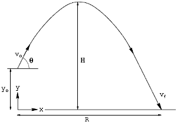

# projetil-calculadora-de-trajeto
Projétil: Calculadora de Trajetória - opencode/html
<html><head><title>Projétil: Calculadora de Trajetória</title>

<meta http-equiv="content-type" content="text/html; charset=UTF-8">
<link rel="icon" type="image/png" href="../../../imagens/favicon.ico">
<meta name="description" content="O portal Ficou Mais Fácil foi eleborado baseado em um moderno conceito de educação que permite a continuidade do aprendizado em casa, através de atividades, vídeos, textos, dicas e muito mais. Com linguagem direta e descomplicada, o estudante terá sempre acesso a um espaço interativo e dinâmico onde poderá aprofundar seus conhecimentos de forma rápida e eficiente.">
<meta name="copyright" content="Ficou Mais Fácil">

</head>
<body style="color: black; background-color: white;">

<!-- DoSiteFMF --><ins class="adsbygoogle" style="display: block;" data-ad-client="ca-pub-5900989438283878" data-ad-slot="7276821741" data-ad-format="auto"><iframe id="aswift_0" style="height: 1px !important; max-height: 1px !important; max-width: 1px !important; width: 1px !important;"><iframe id="google_ads_frame0"></iframe></iframe></ins>

<h1><b>Projétil:
Calculadora de Trajetória</b></h1>

<form name="calc"> 
<table>
<tbody>
<tr>
<td></td>
<td><b>Entre com os valores:</b></td>
<td></td>
</tr>
<tr>
<td><tt>Vo</tt> </td>
<td>= <input maxlength="30" value="0" name="Vel_o"> </td>
<td>metros/segundos
</td>
</tr>
<tr>
<td><tt>θº</tt> </td>
<td>= <input maxlength="30" value="0" name="Theta"> </td>
<td>graus
</td>
</tr>
<tr>
<td><tt>Yo</tt> </td>
<td>= <input maxlength="30" value="0" name="Hgt_o"> </td>
<td>metros
</td>
</tr>
<tr>
<td></td>
<td><b>Resultados:</b></td>
<td></td>
</tr>
<tr>
<td><tt>R</tt> </td>
<td>= <input maxlength="30" value="0" name="range" readonly="readonly"> </td>
<td>metros
</td>
</tr>
<tr>
<td><tt>H</tt> </td>
<td>= <input maxlength="30" value="0" name="height" readonly="readonly"> </td>
<td>metros
</td>
</tr>
<tr>
<td><tt>T</tt> </td>
<td>= <input maxlength="30" value="0" name="time" readonly="readonly"> </td>
<td>segundos
</td>
</tr>
<tr>
<td><tt>Vf</tt> </td>
<td>= <input maxlength="30" value="0" name="speed" readonly="readonly"> </td>
<td>metros/segundos
</td>
</tr>
</tbody>
</table>

<input checked="checked" value="rnd" name="group1" type="radio">
Arredondar&nbsp;&nbsp; <input value="nor" name="group1" type="radio"> Sem arredondar 

<input onclick="calculate()" value="Calcular" type="button"> <input onclick="allclear()" value="Limpar" type="button"> 

</form>

Calcule a altura máxima, intervalo,
tempo no ar e velocidade de impacto de um projétil balístico . Os
cálculos usam a aceleração aproximada da gravidade sobre a superfície
da terra (9,81 m/s2) sem considerar a
resistência do ar. Insira a velocidade inicial, o ângulo inicial e a
altura em relação à superfície do projétil; selecionando a opção de
arredondamento desejado e em seguida, pressione o botão <b>Calcular</b>.
Todas as entradas são zeradas pressionando o botão <b>Limpar</b>.
Se o programa retornar a mensagem de erro: <b>não pode resolver</b>,
então: o ângulo inicial estáora do intervalo 0 . . . 90º, ou a
velocidade é negativa, ou há um valor negativo para a <tt>yo</tt>
(<i>altura inicial</i>) resulta em um valor negativo de H (<i>altura
máxima</i>).

 
<h3>

Este portal está em constante
atualização, portanto, siga-nos
no <a href="http://www.facebook.com/ficoumaisfacil">Facebook</a>
e inscreva-se no nosso canal no <a href="https://www.youtube.com/channel/UCJ7IWmUQ5VgqPhS6K9lnvWw">Youtube</a>
(links abaixo),
para ser notificado sempre que fizermos novas postagens. Fique em dia
com os novos vídeos e conteúdos.

</h3>

&nbsp;&nbsp;

<iframe ng-non-bindable="" frameborder="0" hspace="0" marginheight="0" marginwidth="0" scrolling="no" style="position: static; top: 0px; width: 121px; margin: 0px; border-style: none; left: 0px; visibility: visible; height: 24px;" tabindex="0" vspace="0" width="100%" id="I0_1670280633596" name="I0_1670280633596" src="https://www.youtube.com/subscribe_embed?usegapi=1&amp;channelid=UCJ7IWmUQ5VgqPhS6K9lnvWw&amp;layout=default&amp;count=default&amp;origin=https%3A%2F%2Fwww.ficoumaisfacil.com.br&amp;gsrc=3p&amp;ic=1&amp;jsh=m%3B%2F_%2Fscs%2Fabc-static%2F_%2Fjs%2Fk%3Dgapi.lb.pt_BR.6bdaKiuQqKA.O%2Fd%3D1%2Frs%3DAHpOoo-OFScg4C0i4dWbTehnQjW0xgH1Kw%2Fm%3D__features__#_methods=onPlusOne%2C_ready%2C_close%2C_open%2C_resizeMe%2C_renderstart%2Concircled%2Cdrefresh%2Cerefresh%2Conytevent%2Conload&amp;id=I0_1670280633596&amp;_gfid=I0_1670280633596&amp;parent=https%3A%2F%2Fwww.ficoumaisfacil.com.br&amp;pfname=&amp;rpctoken=17821323" data-gapiattached="true"></iframe>

&nbsp;

<iframe name="f29afe4eaeb473" width="450px" height="1000px" data-testid="fb:like Facebook Social Plugin" title="fb:like Facebook Social Plugin" frameborder="0" allowtransparency="true" allowfullscreen="true" scrolling="no" allow="encrypted-media" src="https://www.facebook.com/v2.5/plugins/like.php?app_id=419052808285249&amp;channel=https%3A%2F%2Fstaticxx.facebook.com%2Fx%2Fconnect%2Fxd_arbiter%2F%3Fversion%3D46%23cb%3Df2623ae07508818%26domain%3Dwww.ficoumaisfacil.com.br%26is_canvas%3Dfalse%26origin%3Dhttps%253A%252F%252Fwww.ficoumaisfacil.com.br%252Ff1af2ffe4cf4d78%26relation%3Dparent.parent&amp;container_width=1887&amp;href=https%3A%2F%2Fwww.ficoumaisfacil.com.br%2Flazer%2Farquivos%2Fprojcalc%2Fcalcproj.htm&amp;locale=pt_BR&amp;sdk=joey&amp;share=true&amp;show_faces=true&amp;width=450" style="border: none; visibility: visible; width: 450px; height: 20px;" class=""></iframe>

&nbsp;
&nbsp;
&nbsp;
&nbsp;

<iframe name="oauth2relay905523654" id="oauth2relay905523654" src="https://accounts.google.com/o/oauth2/postmessageRelay?parent=https%3A%2F%2Fwww.ficoumaisfacil.com.br&amp;jsh=m%3B%2F_%2Fscs%2Fabc-static%2F_%2Fjs%2Fk%3Dgapi.lb.pt_BR.6bdaKiuQqKA.O%2Fd%3D1%2Frs%3DAHpOoo-OFScg4C0i4dWbTehnQjW0xgH1Kw%2Fm%3D__features__#rpctoken=664223038&amp;forcesecure=1" tabindex="-1" aria-hidden="true" style="width: 1px; height: 1px; position: absolute; top: -100px;"></iframe>

                    

                        

                        

                        

                        

                    

                    

                        

                        

                        

                        

                        

                    

                

<table cellpadding="0" cellspacing="0" dir="ltr" style="width:106px;" frame="void" rules="none" class=" gc-bubbleDefault pls-container"><tbody><tr class="gc-reset"><td class="pls-topLeft gc-reset"></td><td class="pls-topTail gc-reset"></td><td class="pls-topRight gc-reset"></td></tr><tr class="gc-reset"><td class="pls-vertShimLeft gc-reset"></td><td class="pls-vertShim gc-reset"></td><td class="pls-vertShimRight gc-reset"></td></tr><tr class="gc-reset"><td class="pls-contentLeft gc-reset"></td><td class="pls-contentWrap gc-reset">
<iframe ng-non-bindable="" frameborder="0" hspace="0" marginheight="0" marginwidth="0" scrolling="no" style="margin:0px;position:absolute;z-index:1;border-style:none;outline:none;width:100px;" tabindex="0" vspace="0" width="100%" id="I0_1670280633980" name="I0_1670280633980" src="https://www.youtube.com/subscribe_embed?action_card=1&amp;channelid=UCJ7IWmUQ5VgqPhS6K9lnvWw&amp;usegapi=1&amp;usegapi=1&amp;jsh=m%3B%2F_%2Fscs%2Fabc-static%2F_%2Fjs%2Fk%3Dgapi.lb.pt_BR.6bdaKiuQqKA.O%2Fd%3D1%2Frs%3DAHpOoo-OFScg4C0i4dWbTehnQjW0xgH1Kw%2Fm%3D__features__#id=I0_1670280633980&amp;_gfid=I0_1670280633980&amp;parent=https%3A%2F%2Fwww.ficoumaisfacil.com.br&amp;pfname=&amp;rpctoken=22467319"></iframe>
</td><td class="pls-dropRight gc-reset"></td></tr><tr class="gc-reset"><td class="pls-bottomLeft gc-reset"></td><td class="gc-reset"><table cellpadding="0" cellspacing="0" style="width:100%" class="gc-reset"><tbody><tr class="gc-reset"><td class="pls-vert gc-reset"></td><td class="pls-dropBottom gc-reset"></td></tr></tbody></table></td><td class="pls-vert gc-reset"></td></tr></tbody></table>

</body></html>
